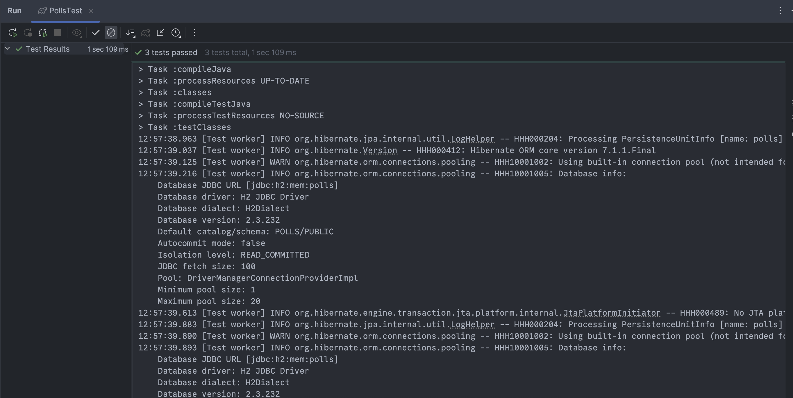
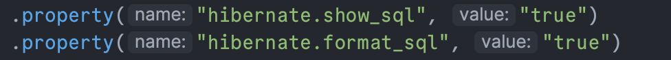
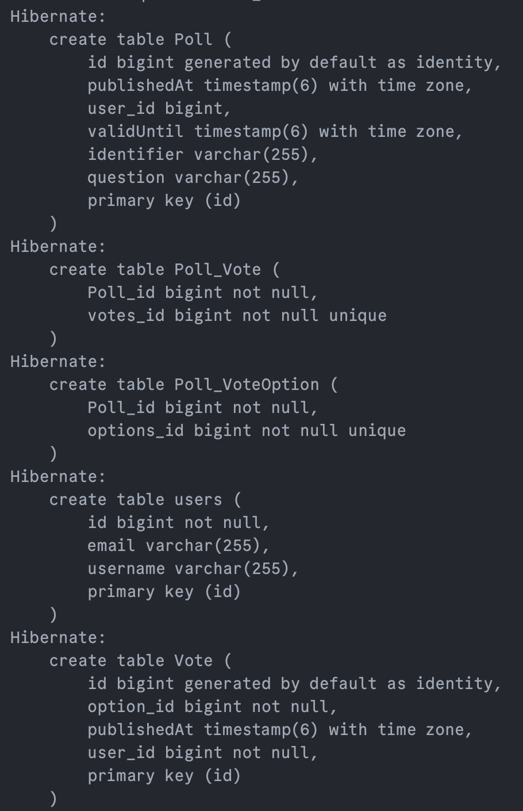

# Experiment 4: JPA

## Technical problems
- Had to change imports to own package name
- I had added an UUID when creating a new user, but with the database being the one to assign one, I removed it
- Some methods were missing when importing the PollsTest.java, so I had to update the classes somewhat to incorporate these new methods
- Have problems with storing the polls after creation, a getAllPolls() returns an empty list. I have made sure that the 
PollManager gets instantiated as the same object, and not with "new ...", but I cant seem to find out why it does not
store the data. This means that the tests from PollsTest do not yet pass, as polls cannot be modified or found after creation,
making it not possible to add voting options or votes to them.

## Code links
[PollController](src/main/java/com/example/demo/controllers/PollController.java)
[UserController](src/main/java/com/example/demo/controllers/UserController.java)
[VoteController](src/main/java/com/example/demo/controllers/VoteController.java)

[Poll](src/main/java/com/example/demo/dm/Poll.java)
[PollManager](src/main/java/com/example/demo/dm/PollManager.java)
[User](src/main/java/com/example/demo/dm/User.java)
[Vote](src/main/java/com/example/demo/dm/Vote.java)
[VoteOption](src/main/java/com/example/demo/dm/VoteOption.java)

[PollsTest](src/test/java/com/example/demo/PollsTest.java)

All tests passed 

## What is happening in the database during the tests?
To see what is happening, I added two lines of code in setup of the
```EntityManagerFactory emf = new PersistenceConfiguration("polls")```
These were:

Now I can see each SQL statement being executed.


## Pending issues
- Have trouble with storing of polls, I can create them but when trying to retrieve, I get an empty list "[]"