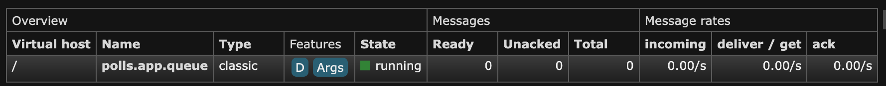
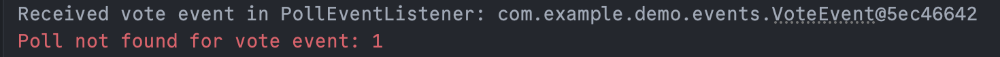

# Experiment 6: Message broker

### Configuration
- Added this to the gradle build file:
    ```java
    implementation("org.springframework.boot:spring-boot-starter-amqp") // Spring AMQP
    ```
- In docker image when creating a new container, assigned ports:
  - 5672:5672 for the application to connect to
  - 15672:15672 for the management UI
  - Confirmed the poll app connects to RabbitMQ by looking at the management web UI in localhost http://localhost:15672/#/
  and signing in with guest guest.

## Testing it works
- It was pretty simple finding out if the message broker was connected - when starting the application it displayed that
it could not connect on port 5672, and thus found out that I had not properly configured the ports in Docker when creating
the container. After fixing it connected and no more running errors.
- I used a version of RabbitMQ with the management plugin, so I could see the queues and messages in a web UI. Here
I could see that I had a connection and had a queue named polls.app.queue, as I had configured.


- In the Spring Boot run window, by sending a message through the RabbitMQ Management UI, I receive this response by
sending a message to the queue, confirming that the application is receiving messages and the connection is there
  

## Technical problems
- Port was wrongly configured in Docker, causing connection issues but was easily fixed (more info in "Testing it works" section)

## Pending issues
Not any known issues at the moment.